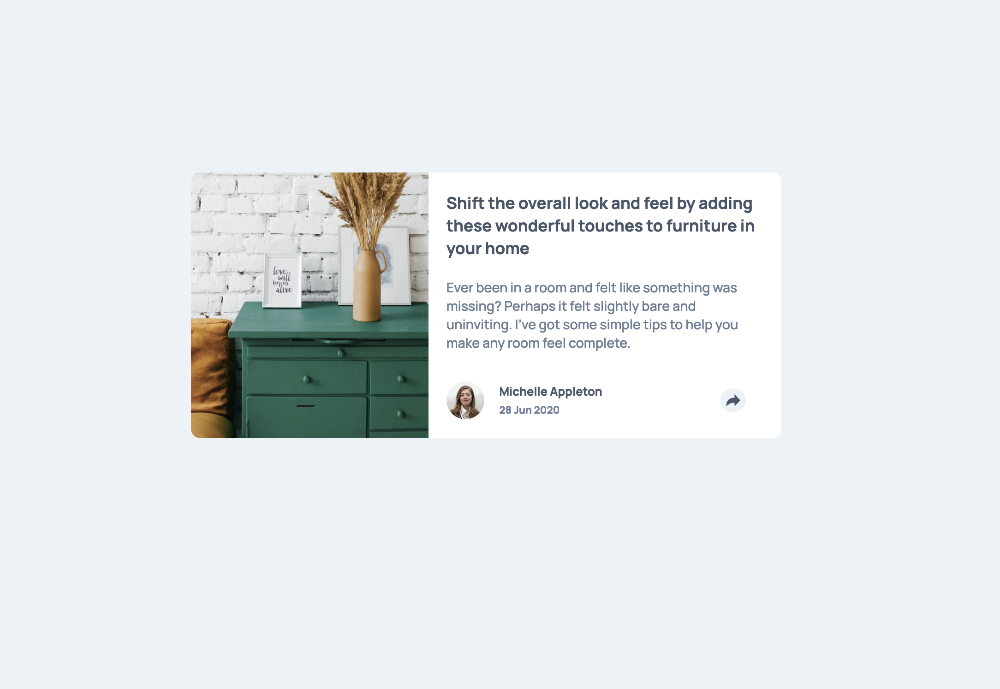

Tried to make this little easy project as good as possible. I had more difficulties with the CSS code than JavaScript
(pretty easy here). I learned functional style as the little arrow from the comics balloon and improved my knowledge
with the 'display: absolute' property.

### Screenshot
Desk =>

Mobile =>

## My process

1) Started from the HTML code.
2) Then the styling in CSS starting with the mobile version with the flexbox column layout.
3) Added the script with the event in it, so you can see the hidden balloon on click.
4) Used @media query to make desk version.
5) Turned the flex layout in the row direction.

### Built with

- HTML
- CSS custom properties
- Flexbox
- Mobile-first workflow
- JavaScript
- Event Handler

### What I learned

I learned a lot from this challenge. Improved with the basics of JavaScript.
 
Moreover I've improved:

- If statement using the DOM;
- Add events and make the webpage interactive;
- Flexibility with css

### Continued development

Keep going through JavaScript, I've just started to work with it, and I would love to know it deeper.

### Useful resources

- MDN;
- Google Search;
- Codecademy cheatsheet

## Author

- Angelo Barbarulo
- GitHub - [@Jorahhh](https://github.com/Jorahhh)
- Frontend Mentor - [@Jorahhh](https://www.frontendmentor.io/profile/Jorahhh)

## Acknowledgments

/